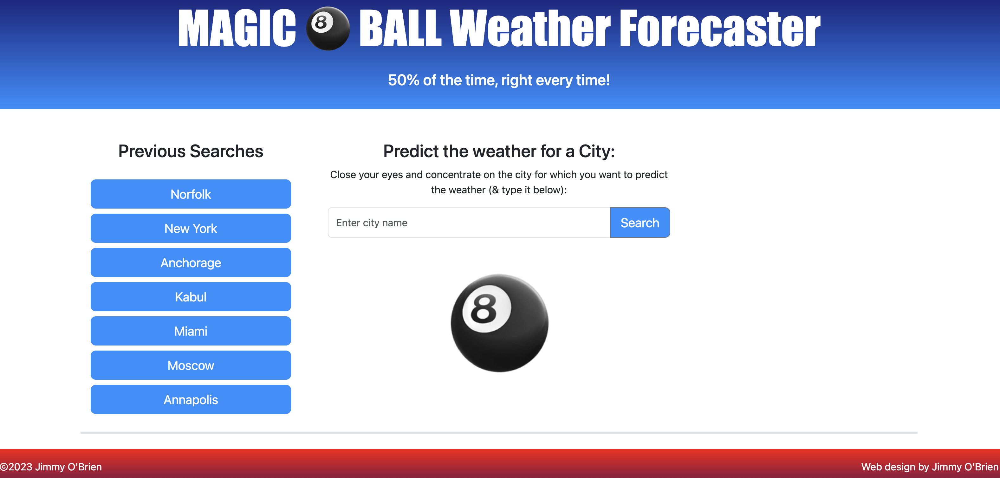

# Magic 8 Ball Weather Forecaster

 

## Description
#### Motivation:
The driving force behind developing this app was to never be surprised by the rain or the scortching heat.

#### Why Build:
This app was created to provide users with an aesthetically pleasing and easy to use weather app.

#### Problem Solved:
In an age of global weather uncertainty, this arms climate activists with a chance to survive one more weathered day, potentially changing the tide in the fight against big oil.

#### What Was Learned:
On the technical side, I've solidified my understanding of core skills like HTML, CSS, and JavaScript, which are essential for front-end development. I've gained hands-on experience with API interactions, learning how to fetch data from an external weather service and dynamically update the user interface based on that data. I've also refined my skills in date manipulation using libraries like Day.js, performed intricate DOM manipulations to refresh the UI, and delved into the principles of responsive design to make my app adaptable across various screen sizes. These technical skills have seamlessly integrated with my growing understanding of design and user experience. I've been forced to consider user-centric design elements, such as creating intuitive UI components, managing loading states, and providing effective error messaging. I've also been introduced to the finer points of crafting an engaging and intuitive user interface, complete with readable weather displays and informative icons. Overall, this project has served as a comprehensive tutorial for me in both technical development and design principles.

## Table of Contents
  * [Installation](#installation)
  * [Usage](#usage)
  * [Credits](#credits)
  * [License](#license)
  * [Badges](#badges)
  * [Features](#features)
  * [How to Contribute](#how-to-contribute)

## Installation Instructions
#### Step 1:
Access the Git Repository at https://github.com/JimmyJr77/weather_forcaster 

#### Step 2:
Clone this GitHub repository to your local machine using git clone.

#### Step 3:
Open index.html file

## Usage
#### Access the deployed application:
Access the deployed application at https://jimmyjr77.github.io/weather_forcaster/

#### Example 1:
You can search for a city by typing the city name into the search bar and hit "search". It will save the city to the Previous Searches section and load current and forecasted weather for that city.

#### Example 2:
Select a city from your previous searches to render current and forecasted weather data.

## Credits
#### Individual Credits:
  * I received support from my classmate Youssef on some structural considerations

#### Tutorials Followed:

  * https://coding-boot-camp.github.io/full-stack/apis/how-to-use-api-keys for API information
  * https://openweathermap.org/forecast5 for API format
  * https://getbootstrap.com/docs for layout and design
  * https://chat.openai.com for support dialogue

## License
MIT License

## Badges
  * 

## Features
  * Magic 8 ball shakes with every click!!!
  * Beautiful front end design in the mold of a sunset, complete with evening sky up top and the sun beeming over the red sky at the bottom.
  * Previous Searches: Access the last 7 prior city weather searches.
  * Predict the weather for a specific city by entering the city name.
  * Current weather is recorded with date, temp, wind speed, and humidity.
  * 5 day forecast for the selected city.

## How to Contribute
Contributions to the Employee Tracker application are encouraged and can be made by forking the repository on GitHub, creating a new branch, making changes to enhance functionality, and submitting a pull request. The maintainers will review the changes, provide feedback if needed, and merge approved contributions into the main branch. This collaborative process allows contributors to actively improve the Note Taker application and make it more valuable for users.

## Questions 
If you have any questions about the content, instructions, or how to get involved in this project, please contact: 

  * Jimmy O'Brien    
    GitHub Username: [jimmyjr77](https://github.com/jimmyjr77/)    
    Email Address: jimmyjr.obrien@gmail.com    